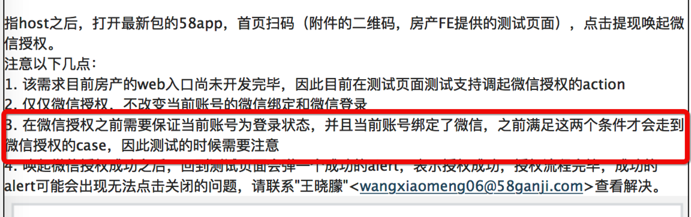
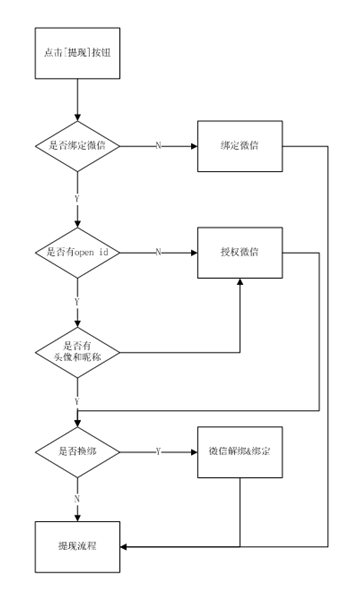

### 授权联调注意事项



### UI:

http://uxd.58corp.com/index.php?share/folder&user=xuqd&sid=mRrkdiYa#
http://uxd.58corp.com/index.php?share/folder&user=xuqd&sid=FaReIDSG#

### 提现流程图

http://iwork3.58corp.com/issue/detail/WX-393



### 1.绑定微信协议  孟静楠


```
{"action":"third_bind", type:"QQ,WEIXIN,SINA,PHONE", callback:"",autoBack:"true/false"}
```


【type】:（字符串），必传，非空。需要绑定的第三方账号（qq，微信，微博），可以多绑定；v6.1.2之后，支持手机号绑定；

 【callback】：（字符串）回调的js方法名；我们默认传递是否绑定成功参数（0：成功    1：失败 支持只有一种绑定type）

【autoBack】：（布尔型）绑定页面绑定成功之后是否自动退出；


### 2.获取绑定微信头像、昵称、openId接口

http://c.58corp.com/pages/viewpage.action?pageId=14092686

唐万超  12:16
是微信开放平台的appid吗
唐万超  12:16
wxc7929cc3d3fda545

string 类型

### 3.授权
授权：提现之授权逻辑--mengjingnan  孟敬楠

```
{
"action": "wx_auth",  
"callback":""  
}
```

【callback】: callback 授权结果的回调。 callback(result) result : true|false 成功|失败


### 4.换绑：跳转到个人中心进行换绑
协议  wbmain://jump/core/userInfoDetail?isLogin=true
具体咨询孟静楠

使用app封装的loadPage跳转

```
WBAPP._nativeBridge({
    action:"pagetrans",
    tradeline:"core",
    content:{
    pagetype:"userInfoDetail"
    }
});


```

来源：无线FE-雷涛


### 提现接口：

http://c.58corp.com/pages/viewpage.action?pageId=14092686

提现接口：http://houserent.m.58.com/order/api_withdraw_cash

参数：orderId


#7.13+ 版本微信解绑--直接在当前页面调用，无需跳转到个人中心

```
callback 0成功  1失败  2 取消（弹层取消） 3未绑定   4 未登录

 WBAPP._nativeBridge({
            "action":"unbind_account",
            "type":"WEIXIN",
            "callback":"callbackName"
        })
```

#7.13+ 版本微信绑定
```
   * @param {String} type 必填项，需要绑定的第三方账号 

   * @param {String} callback 必填项，回调的js方法名，默认传递是否绑定成功参数（0：成功    1：失败 支持只有一种绑定type）

   * @param {String} autoBack 选填项，绑定页面绑定成功之后是否自动退出

    WBAPP._nativeBridge({
        "action":"third_bind",
        "type":"WEIXIN",
        "callback":"callbackName"
    })

```

